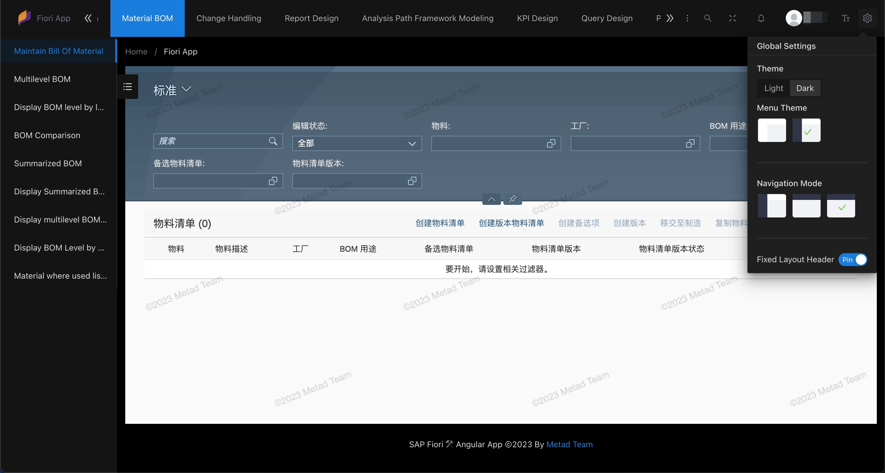

<h1 align="center">SAP Fiori App Templates</h1>

<p align="center">
  <a href="https://angular.dev/"></a><a href="https://vuejs.org/"></a>
</p>
<p align="center">
<a title="Ant Design" href="https://ant-design.antgroup.com/index-cn"></a><a title="SAP Fiori Design" href="https://experience.sap.com/fiori-design-web/"></a>
</p>
<p align="center">
  <em>This workspace contains multiple development templates for building mobile and desktop SAP Fiori applications
    <br> using Angular, Vue, React frameworks and Ant Design.</em>
  <br>
</p>

<p align="center">
  <a href="https://www.mtda.cloud/en/"><strong>www.mtda.cloud</strong></a>
  <br>
</p>

**English** | [**中文**](./README_zh.md)

## 🌟 What is this?

This is a collection of SAP Fiori application templates built by third-party front-end frameworks (Vue, Angular, React, etc.). It is based on [Nx](https://nx.dev) and [UI5 Tooling](https://sap.github.io/ui5-tooling/).

There are several advantages to using open-source frameworks to create Fiori applications:

* A robust ecosystem and active developer community that provide solutions, sample code, and plugins.
* Rich component libraries and templates.
* Cross-platform consistency, supporting responsive design to adapt to various screen sizes and devices.
* Flexible UI customization, including layout, components, and styles to ensure alignment with your brand.
* Features like virtual DOM (in React), asynchronous rendering, and on-demand component loading that greatly enhance performance.
* Provides state management tools for effective control of application state and data flow, particularly beneficial for handling large and complex SAP Fiori applications.
* Flexibility and extensibility.
* Easy to learn and use, enabling new developers to quickly get started and improve efficiency.

## 📄 How to use

You can download the template under this code repository and then modify and deploy it, or you can build a project from scratch according to our creation steps.

We plan to provide project templates in multiple frameworks and multiple combinations. The templates that have been developed can all be used.

* [Angular standalone workspace](./angular-standalone/)
* [Vue standalone workspace](./sap-fiori-vue-standalone/)
* React standalone workspace

## ✨ Features

* Modern front-end frameworks such as **Angular**, **Vue**, or React.
* Modern state management frameworks like NgRx, Vuex, or Redux.
* A locally running **mock server** that doesn't require a network connection to a backend system, useful for development and testing scenarios.
* Use **live data** on ABAP System for development and testing scenarios.
* **One-click deployment** to SAP ABAP on-premise systems or SAP BTP Cloud Foundry.
* **CI/CD** integration.
* Adherence to **Ant Design** enterprise-level product design specifications.
* Integration of [**SAP Web Components**](https://experience.sap.com/fiori-design-web/v1-118/web-components-overview/), following SAP Fiori design guidelines.
* Integration of **existing SAP Fiori Apps** for direct use.
* Base on SAP Fiori Launchpad **authorization roles**.
* Three website page **layouts**, supporting left-side menu, top menu, and a combination of top and left-side menus.
* Support for multiple themes, including **Light** and **Dark** themes.
* Multiple website **primary color** options, including Twilight, Volcano, Dawn, Daybreak, Aurora Green, Twilight Blue, Geek Blue, and Sauce Purple.
* **Internationalization** for multi-language switching.
* Website **watermark** functionality.
* Global application **search** feature.
* **Full-screen** mode for web pages and Fiori applications.
* Support for SAP system **notification** messages.

## 🌼 Screenshots

### Side Menu Bar


<details>
<summary>Show / Hide Screenshots</summary>

### Search Fiori Apps


### Top Menu Bar


### More Fiori Apps Menu


### Dark Theme



### Internationalization


</details>

## 🧱 Best practices

### Login Mode

In the SAP Fiori Launchpad, it's usually necessary to log in to the FLP page first before gaining access to the apps within the Launchpad. If you want to log in to the SAP system without accessing the FLP login page, you can achieve this by configuring the error page handling for the app as follows:

1. Log in to SAPGUI and open transaction code **SICF**.
2. In the service path, enter */sap/bc/ui5_ui5/sap/`your_project_name`* and execute to open the service node where the app is located.
3. Right-click on this service node and select *Display Service* to open the service details page.
4. Switch to the *Error Pages* tab and change *Login Error* to *System Login*.
5. Access and log in using the URL */sap/bc/ui5_ui5/sap/`your_project_name`/?sap-client=`100`*.

### Fiori Deploy Error

When encountering Fiori Deploy errors without displaying specific error information, you can analyze the issue by modifying the code in the *node_modules/@sap/ux-ui5-tooling/dist/cli/index.js* file to print detailed information. Print error information within the `function tryDeploy` code.

### SAP UserContext

When facing account access issues, you can check if the values such as *sap-client* in the *sap-usercontext* property within the browser's cookies are correct.

### Nx

[Nx](https://nx.dev/) is a powerful tool for building and managing modern applications, especially well-suited for large and complex projects.

#### Running tasks

To execute tasks with Nx use the following syntax:

```
npx nx <target> <project> <...options>
```

You can also run multiple targets:

```
npx nx run-many -t <target1> <target2>
```

..or add `-p` to filter specific projects

```
npx nx run-many -t <target1> <target2> -p <proj1> <proj2>
```

Targets can be defined in the `project.json`. Learn more [in the docs](https://nx.dev/core-features/run-tasks).

## 🍺 How to contribute

- Please give us :star: on Github, it **helps**!
- You are more than welcome to submit feature requests in the [sap-fiori-templates repo](https://github.com/meta-d/sap-fiori-templates/issues)
- Pull requests are always welcome! Please base pull requests against the _develop_ branch.

## 💌 Contact Us

- For business inquiries: <mailto:service@mtda.cloud>
- [Follow us on Twitter](https://twitter.com/CloudMtda)
- [Subscribe to the Metad Youtube Channel](https://www.youtube.com/channel/UCt6J-QN4atwD-9F73Me814A)

## 🙋 Enterprise Support

* If your company requires technical support, please contact us at: <mailto:service@mtda.cloud>
* Or add our WeChat ID: **metad-cloud**

<p align="center">
<a title="Wechat" href="https://www.mtda.cloud/#connect"></a>
</p>