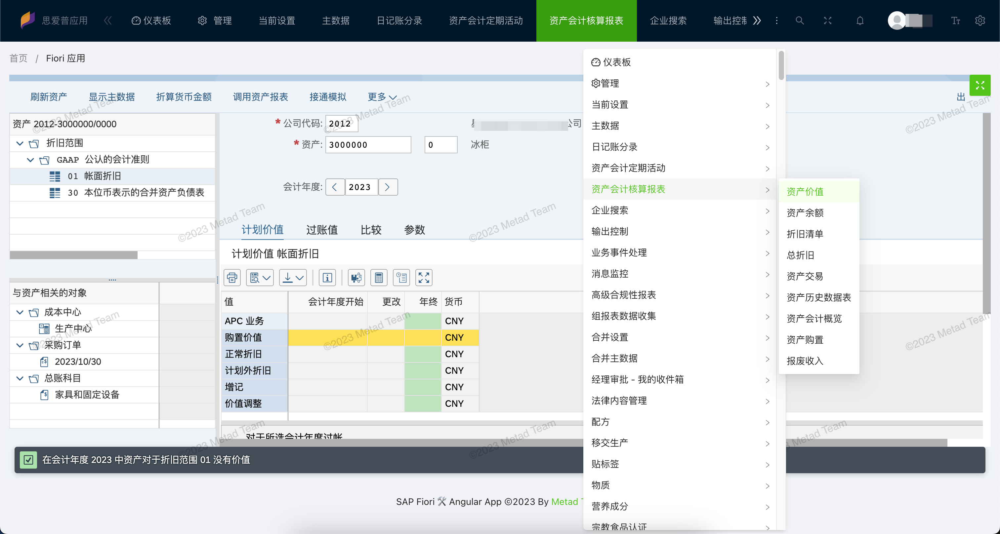

# SAP Fiori App Templates

## 🌟 What is this?

This is a collection of templates which are builded by third-party frontend frameworks (Vue, Angular, React ...) for SAP Fiori apps. It is based on [Nx](https://nx.dev) and [UI5 Tooling](https://sap.github.io/ui5-tooling/).

## 📄 How to use

You can download the template under this code repository and then modify and deploy it, or you can build a project from scratch according to our creation steps.

We plan to provide project templates in multiple frameworks and multiple combinations. The templates that have been developed can all be used.

* [Angular standalone workspace](./angular-standalone/)
* [Vue standalone workspace](./sap-fiori-vue-standalone/)
* React standalone workspace

### Nx

#### 🚀 Running tasks

To execute tasks with Nx use the following syntax:

```
nx <target> <project> <...options>
```

You can also run multiple targets:

```
nx run-many -t <target1> <target2>
```

..or add `-p` to filter specific projects

```
nx run-many -t <target1> <target2> -p <proj1> <proj2>
```

Targets can be defined in the `package.json` or `projects.json`. Learn more [in the docs](https://nx.dev/core-features/run-tasks).

## 🌼 Screenshots

### Side Menu Bar


<details>
<summary>Show / Hide Screenshots</summary>

### Search Fiori Apps


### Top Menu Bar


### More Fiori Apps Menu


### Dark Theme


</details>

## 🧱 Best practices

### Login

在 SAP Fiori Lanuchpad 上通常是先登录 flp 页面然后才有权限访问 Lanuchpad 里的 Apps, 如果你想无需访问 flp 登录页面也可登录 SAP 系统的话可以通过配置 app 的错误页-登录错误的处理方式来实现：

1. 登录 SAPGUI 打开事务码 **SICF**
2. 在服务路径中输入 */sap/bc/ui5_ui5/sap/your_project_name* 执行打开应用所在服务节点
3. 在此服务节点上右键菜单中点击 *显示服务* 打开服务详情界面
4. 切到 *错误页* 页签，再将 *登录错误* 切换为 *系统登录*
5. 使用地址 */sap/bc/ui5_ui5/sap/your_project_name/?sap-client=<300>* 访问和登录

### Fiori Deploy Error

当遇到 Fiori Deploy 错误时，但并没有显示具体错误信息，可以通过修改 *node_modules/@sap/ux-ui5-tooling/dist/cli/index.js* 文件中的代码打印出详细信息进行分析。
在 `function tryDeploy` 函数代码中打印出错误信息。

### SAP UserContext

在遇到账号访问问题时，可以查看浏览器 Cookie 中的属性 *sap-usercontext* 值中的 *sap-client* 等值是否正确。

## Set up CI!

Nx comes with local caching already built-in (check your `nx.json`). On CI you might want to go a step further.

- [Set up remote caching](https://nx.dev/core-features/share-your-cache)
- [Set up task distribution across multiple machines](https://nx.dev/core-features/distribute-task-execution)
- [Learn more how to setup CI](https://nx.dev/recipes/ci)

## 🍺 How to contribute

- Please give us :star: on Github, it **helps**!
- You are more than welcome to submit feature requests in the [sap-fiori-templates repo](https://github.com/meta-d/sap-fiori-templates/issues)
- Pull requests are always welcome! Please base pull requests against the _develop_ branch.

## 💌 Contact Us

- For business inquiries: <mailto:service@mtda.cloud>
- [Follow us on Twitter](https://twitter.com/CloudMtda)
- [Subscribe to the Metad Youtube Channel](https://www.youtube.com/channel/UCt6J-QN4atwD-9F73Me814A)