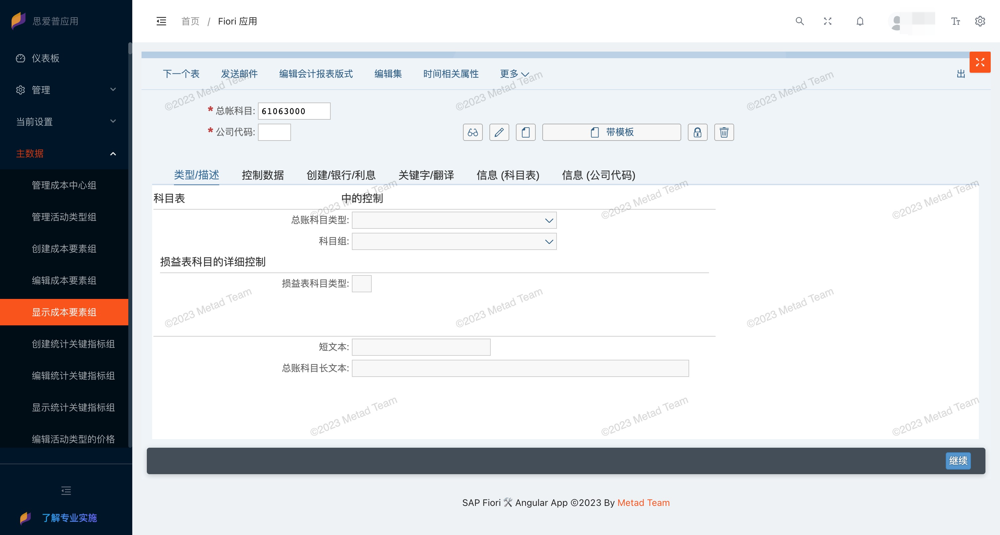
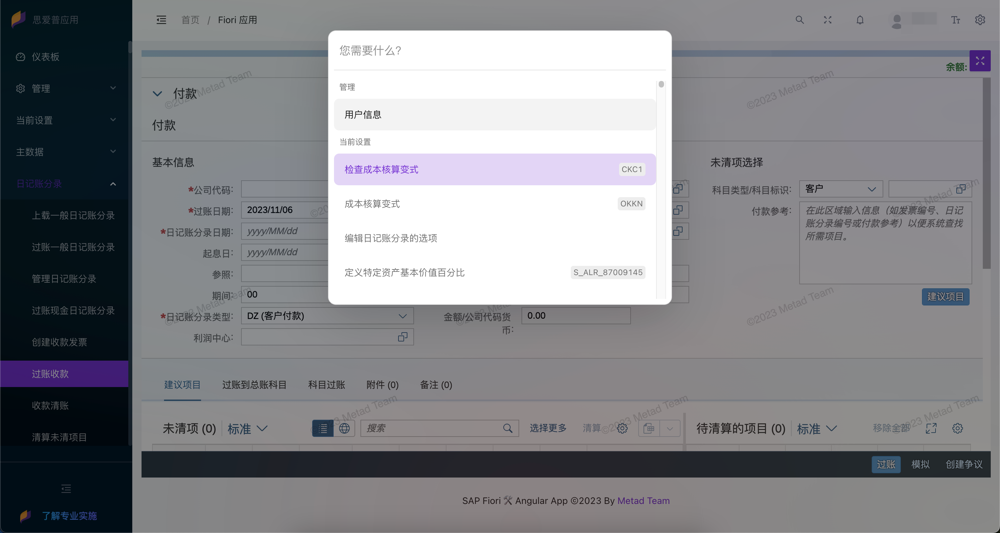
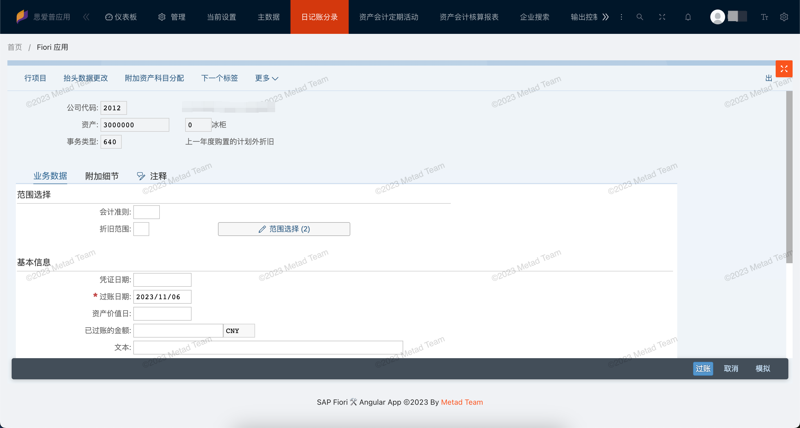
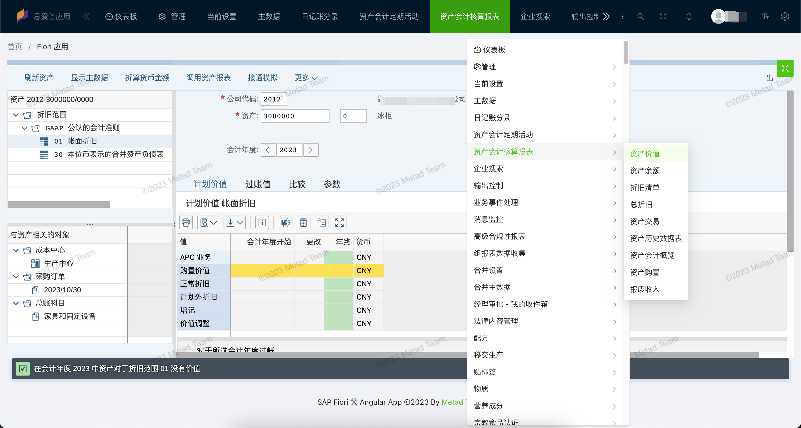
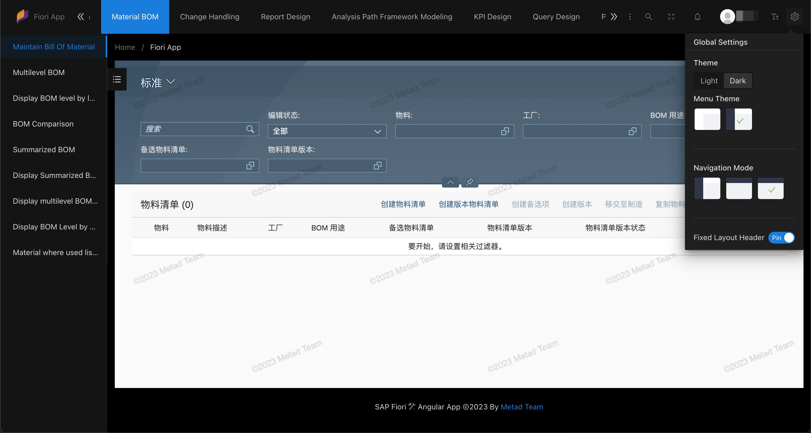
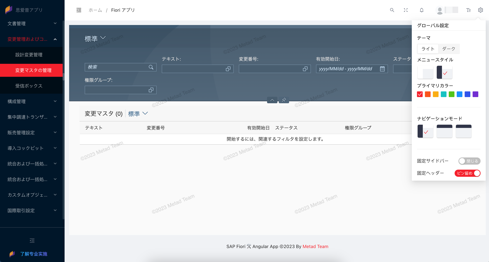

<h1 align="center">SAP Fiori 应用模版</h1>

<p align="center">
  <a title="Angular" href="https://angular.dev/"></a><a title="Vuejs" href="https://vuejs.org/"></a>
</p>
<p align="center">
<a title="Ant Design" href="https://ant-design.antgroup.com/index-cn"></a><a title="SAP Fiori Design" href="https://experience.sap.com/fiori-design-web/"></a>
</p>
<p align="center">
  <em>此工作空间包含多个开发模板用于构建移动和桌面 SAP Fiori 应用程序
    <br>使用 Angular、Vue、React 等框架和 Ant Design 设计规范</em>
  <br>
</p>

<p align="center">
  <a href="https://www.mtda.cloud/en/"><strong>www.mtda.cloud</strong></a>
  <br>
</p>

[**English**](./README.md) | **中文**

## 🌟 这是什么？

这是一个由第三方前端框架（Angular、Vue、React等）构建的 SAP Fiori 应用程序模板集合。它基于 [Nx](https://nx.dev) 和 [UI5 Tooling](https://sap.github.io/ui5-tooling/)。
使用开源框架来创建 Fiori 应用有很多优势：
* 强大的生态系统和活跃的开发社区，提供了问题解决方案、示例代码和插件。
* 丰富的组件库和模板。
* 跨平台一致性，支持响应式设计，使应用程序能够适应不同的屏幕尺寸和设备。
* 灵活的 UI 定制，包括布局、组件和样式，以确保应用程序与您的品牌一致。
* 虚拟DOM（在React中）、异步渲染和按需加载组件能极大地提高性能。
* 提供了状态管理工具有效地管理应用程序的状态和数据流。这对于处理大型和复杂的 SAP Fiori 应用非常有帮助。
* 灵活性和可扩展性。
* 易于学习和使用，新开发人员能够快速上手并提高效率。

## 📄 如何使用？

您可以在此代码存储库中下载模板，然后进行修改和部署，或者您可以根据我们的创建步骤从头开始构建项目。

我们计划提供多个框架和多种组合的项目模板。已开发的模板都可以使用。

* [Angular standalone workspace](./angular-standalone/)
* [Vue standalone workspace](./sap-fiori-vue-standalone/)
* React standalone workspace

## ✨ 功能特性

* 现代前端框架 **Angular**、**Vue** 或 React。
* 现代**状态管理**框架 NgRx、Vuex 或 Redux。
* 本地运行**模拟服务器**，无需连接到后端系统，适用于开发和测试场景。
* 使用 ABAP 系统上的**实时数据**进行开发和测试。
* **一键部署**到 SAP ABAP on-premise 系统或 SAP BTP Cloud Foundry。
* **CI / CD** 集成。
* 使用了 **Ant Design** 企业级产品设计规范。
* 支持 SAP Fiori 设计规范的 [**SAP Web Components**](https://experience.sap.com/fiori-design-web/v1-118/web-components-overview/)
* 集成了已有的 SAP **Fiori Apps**，可直接使用。
* 基于 SAP Fiori Launchpad 的**授权角色**。
* 三种网站**页面布局**，支持左侧菜单、顶部菜单和顶部+左侧混合菜单。
* 支持多种主题，包括 **Light** 和 **Dark** 主题。
* 多种网站**主色调**，包括薄暮、火山、日暮、明青、极光绿、拂晓蓝、极客蓝、酱紫。
* **国际化**多语言切换。
* 网站**水印**功能。
* 全局应用**搜索**功能。
* 网页和 Fiori 应用**全屏**功能。
* 支持 SAP 系统**通知消息**。

## 🌼 屏幕截图

### 侧边菜单模式



<details>
<summary>显示 / 隐藏 屏幕截图</summary>

### 全局搜索应用



### 顶部菜单模式



### 更多菜单列表



### 暗色主题



### 国际化语言



</details>

## 🧱 最佳实践

### 登录方式

在 SAP Fiori Lanuchpad 上通常是先登录 flp 页面然后才有权限访问 Lanuchpad 里的 Apps, 如果你想无需访问 flp 登录页面也可登录 SAP 系统的话可以通过配置 app 的错误页-登录错误的处理方式来实现：

1. 登录 SAPGUI 打开事务码 **SICF**
2. 在服务路径中输入 */sap/bc/ui5_ui5/sap/`your_project_name`* 执行打开应用所在服务节点
3. 在此服务节点上右键菜单中点击 *显示服务* 打开服务详情界面
4. 切到 *错误页* 页签，再将 *登录错误* 切换为 *系统登录*
5. 使用地址 */sap/bc/ui5_ui5/sap/`your_project_name`/?sap-client=`100`* 访问和登录

### Fiori 部署错误

当遇到 Fiori Deploy 错误时，但并没有显示具体错误信息，可以通过修改 *node_modules/@sap/ux-ui5-tooling/dist/cli/index.js* 文件中的代码打印出详细信息进行分析。
在 `function tryDeploy` 函数代码中打印出错误信息。

### SAP UserContext

在遇到账号访问问题时，可以查看浏览器 Cookie 中的属性 *sap-usercontext* 值中的 *sap-client* 等值是否正确。

### Nx

[Nx](https://nx.dev/) 是一个用于构建和管理现代应用程序的强大工具，特别适用于大型和复杂的项目。

#### 运行任务

要使用 Nx 执行任务，请使用以下语法：

```
npx nx <target> <project> <...options>
```

您还可以运行多个目标：

```
npx nx run-many -t <target1> <target2>
```

...或添加 `-p` 以过滤特定项目：

```
npx nx run-many -t <target1> <target2> -p <proj1> <proj2>
```

目标可以在 `project.json` 中定义。了解更多信息请参阅[文档](https://nx.dev/core-features/run-tasks)。

## 🍺 如何贡献

- 请在 Github 上给我们 :star:，这**有助于**我们得到更好地支持和开发新功能！
- 欢迎在 [sap-fiori-templates 仓库](https://github.com/meta-d/sap-fiori-templates/issues) 中提交功能请求。
- 我们随时欢迎 Pull 请求！请基于 _develop_ 分支提交 Pull 请求。

## 💌 联系我们

- 商务合作垂询： <mailto:service@mtda.cloud>
- [在 Twitter 上关注我们](https://twitter.com/CloudMtda)
- [订阅 Metad 的 YouTube 频道](https://www.youtube.com/channel/UCt6J-QN4atwD-9F73Me814A)

## 🙋 企业支持

如果您的公司需要技术支持，请联系我们：<mailto:service@mtda.cloud>

或添加微信号：**metad-cloud**

<p align="center">
<a title="Wechat" href="https://www.mtda.cloud/#connect"></a>
</p>