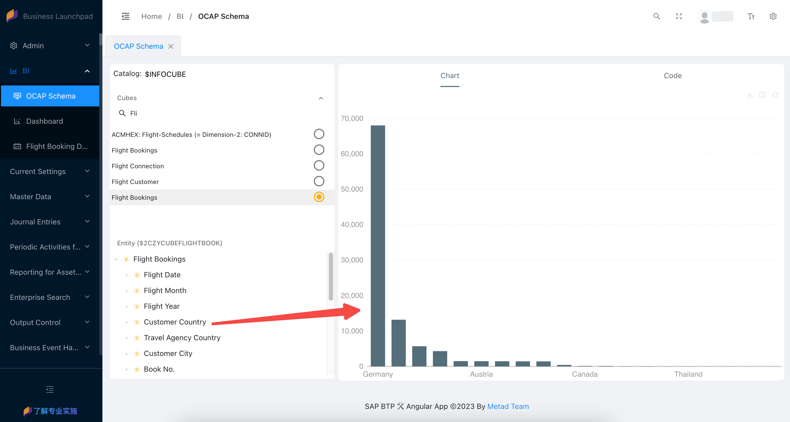

# 📊 Embedded BI

This section describes how to develop embedded data analysis applications in SAP S4 system using the ocap framework.

## Why embedded analytics?

**Embedded analytics** is a concept involving keeping the data in the operating system – in the case of *SAP S/4HANA* system it’s **SAP HANA database** – and then, using a mechanism called a virtual data model, transforming on-the-fly data optimized for transactional purposes into an analytics-ready structure. The entire process occurs using the SAP Fiori user interface or BI service.

> **For real-time operational reporting**

## CDS Demo Models

We will use SAP Demo data flight booking data for demonstration and embed data analysis through CDS.

> You can use program `SAPBC_DATA_GENERATOR` to generate data for SAP flight demo tables.

### ABAP CDS

Create the following cds views in order:

* __DIMENSION__: Airline

```sql
@AbapCatalog.sqlViewName: 'ZDIMEAIRLINE'
@AbapCatalog.compiler.compareFilter: true
@AccessControl.authorizationCheck: #CHECK
@EndUserText.label: 'Airline'

@Analytics.dataCategory: #DIMENSION

define view Z_Dimension_Airline
  as select from scarr
{
      @ObjectModel.text.element: [ 'AirlineName' ]
  key carrid   as Airline,
  
      @Semantics.text: true
      carrname as AirlineName,
      
      @Semantics.currencyCode: true
      currcode as Currency
}
```

* __DIMENSION__: Connection

```sql
@AbapCatalog.sqlViewName: 'ZDIMECONNECT'
@AbapCatalog.compiler.compareFilter: true
@AccessControl.authorizationCheck: #CHECK
@EndUserText.label: 'Flight Connection'

@Analytics.dataCategory: #DIMENSION

@ObjectModel.representativeKey: 'FlightConnection'

define view Z_Dimension_Connection
  as select from spfli
  association [0..1] to Z_Dimension_Airline as _Airline on $projection.Airline = _Airline.Airline
{
      @ObjectModel.foreignKey.association: '_Airline'
  key carrid                    as Airline,

      @ObjectModel.text.element: [ 'Destination' ]
  key connid                    as FlightConnection,

      @Semantics.text: true
      concat(cityfrom,
        concat(' -> ', cityto)) as Destination,

      _Airline
}
```

* __DIMENSION__: Customer

```sql
@AbapCatalog.sqlViewName: 'ZDIMECUSTOMER'
@AbapCatalog.compiler.compareFilter: true
@AccessControl.authorizationCheck: #CHECK
@EndUserText.label: 'Flight Customer'

@Analytics.dataCategory: #DIMENSION

define view Z_Dimension_Customer
  as select from scustom
  association [0..1] to I_Country as _Country on $projection.Country = _Country.Country
{
      @ObjectModel.text.element: [ 'CustomerName' ]
  key id      as Customer,

      @Semantics.text: true
      name    as CustomerName,

      @ObjectModel.foreignKey.association: '_Country'
      @Semantics.address.country: true
      country as Country,

      @Semantics.address.city: true
      city    as City,
      
      _Country
}
```

* __DIMENSION__: Travel Agency

```sql
@AbapCatalog.sqlViewName: 'ZDIMETRVAGENCY'
@AbapCatalog.compiler.compareFilter: true
@AccessControl.authorizationCheck: #CHECK
@EndUserText.label: 'Travel Agency'

@Analytics.dataCategory: #DIMENSION

define view Z_Dimension_TravelAgency
  as select from stravelag
  association [0..1] to I_Country as _Country on $projection.Country = _Country.Country
{
      @ObjectModel.text.element: [ 'TravelAgencyName' ]
  key agencynum as TravelAgency,

      @Semantics.text: true
      name      as TravelAgencyName,

      @ObjectModel.foreignKey.association: '_Country'
      @Semantics.address.country: true
      country   as Country,

      @Semantics.address.city: true
      city      as City,
      
      _Country
}
```

* __CUBE__: Flight Bookings

```sql
@AbapCatalog.sqlViewName: 'ZCUBEFLIGHTBOOK'
@AbapCatalog.compiler.compareFilter: true
@AccessControl.authorizationCheck: #CHECK
@EndUserText.label: 'Flight Bookings'

@Analytics.dataCategory: #CUBE

define view Z_Cube_FlightBookings
  as select from sbook
  association [0..1] to I_CalendarDate           as _CalendarDate on  $projection.FlightDate = _CalendarDate.CalendarDate
  association [0..1] to Z_Dimension_Airline      as _Airline      on  $projection.Airline = _Airline.Airline
  association [0..1] to Z_Dimension_Connection   as _Connection   on  $projection.Airline          = _Connection.Airline
                                                                  and $projection.FlightConnection = _Connection.FlightConnection
  association [0..1] to Z_Dimension_Customer     as _Customer     on  $projection.Customer = _Customer.Customer
  association [0..1] to Z_Dimension_TravelAgency as _TravelAgency on  $projection.TravelAgency = _TravelAgency.TravelAgency
{
  /** DIMENSIONS **/

  @EndUserText.label: 'Airline'
  @ObjectModel.foreignKey.association: '_Airline'
  carrid                 as Airline,

  @EndUserText.label: 'Connection'
  @ObjectModel.foreignKey.association: '_Connection'
  connid                 as FlightConnection,

  @EndUserText.label: 'Flight Date'
  @ObjectModel.foreignKey.association: '_CalendarDate'
  fldate                 as FlightDate,

  @EndUserText.label: 'Book No.'
  bookid                 as BookNumber,

  @EndUserText.label: 'Customer'
  @ObjectModel.foreignKey.association: '_Customer'
  customid               as Customer,

  @EndUserText.label: 'Travel Agency'
  @ObjectModel.foreignKey.association: '_TravelAgency'
  agencynum              as TravelAgency,

  @EndUserText.label: 'Flight Year'
  _CalendarDate.CalendarYear,

  @EndUserText.label: 'Flight Month'
  _CalendarDate.CalendarMonth,

  @EndUserText.label: 'Customer Country'
  @ObjectModel.foreignKey.association: '_CustomerCountry'
  _Customer.Country      as CustomerCountry,

  @EndUserText.label: 'Customer City'
  _Customer.City         as CustomerCity,

  @EndUserText.label: 'Travel Agency Country'
  @ObjectModel.foreignKey.association: '_TravelAgencyCountry'
  _TravelAgency.Country  as TravelAgencyCountry,

  @EndUserText.label: 'Travel Agency Customer City'
  _TravelAgency.City     as TravelAgencyCity,

  /** MEASURES **/

  @EndUserText.label: 'Total of Bookings'
  @DefaultAggregation: #SUM
  1                      as TotalOfBookings,

  @EndUserText.label: 'Weight of Luggage'
  @DefaultAggregation: #SUM
  @Semantics.quantity.unitOfMeasure: 'WeightUOM'
  luggweight             as WeightOfLuggage,

  @EndUserText.label: 'Weight Unit'
  @Semantics.unitOfMeasure: true
  wunit                  as WeightUOM,

  @EndUserText.label: 'Booking Price'
  @DefaultAggregation: #SUM
  @Semantics.amount.currencyCode: 'Currency'
  forcuram               as BookingPrice,

  @EndUserText.label: 'Currency'
  @Semantics.currencyCode: true
  forcurkey              as Currency,

  // Associations
  _Airline,
  _CalendarDate,
  _CalendarDate._CalendarMonth,
  _CalendarDate._CalendarYear,
  _Connection,
  _Customer,
  _Customer._Country     as _CustomerCountry,
  _TravelAgency,
  _TravelAgency._Country as _TravelAgencyCountry
}
```

* __QUERY__: Flight Bookings

```sql
@AbapCatalog.sqlViewName: 'ZQUERYFLIGHTBOOK'
@AbapCatalog.compiler.compareFilter: true
@AccessControl.authorizationCheck: #CHECK
@EndUserText.label: 'Flight Bookings'

@Analytics.query: true
@VDM.viewType: #CONSUMPTION

define view Z_Query_FlightBookings
  as select from Z_Cube_FlightBookings
{
    /** DIMENSIONS **/
    
    @AnalyticsDetails.query.display: #KEY_TEXT
    @AnalyticsDetails.query.axis: #FREE
    Airline, 
    @AnalyticsDetails.query.display: #KEY_TEXT
    @AnalyticsDetails.query.axis: #FREE
    FlightConnection, 
    @AnalyticsDetails.query.display: #KEY
    @AnalyticsDetails.query.axis: #FREE
    FlightDate, 
    @AnalyticsDetails.query.display: #KEY_TEXT
    @AnalyticsDetails.query.axis: #FREE
    Customer, 
    @AnalyticsDetails.query.display: #KEY_TEXT
    @AnalyticsDetails.query.axis: #FREE
    TravelAgency, 
    @AnalyticsDetails.query.display: #KEY
    @AnalyticsDetails.query.axis: #FREE
    CalendarYear,
    @AnalyticsDetails.query.display: #TEXT
    @AnalyticsDetails.query.axis: #FREE
    CalendarMonth,
    @AnalyticsDetails.query.display: #TEXT
    @AnalyticsDetails.query.axis: #FREE
    CustomerCountry,
    @AnalyticsDetails.query.display: #KEY
    @AnalyticsDetails.query.axis: #FREE
    CustomerCity,
    @AnalyticsDetails.query.display: #TEXT
    @AnalyticsDetails.query.axis: #FREE
    TravelAgencyCountry,
    @AnalyticsDetails.query.display: #KEY
    @AnalyticsDetails.query.axis: #FREE
    TravelAgencyCity,
    @AnalyticsDetails.query.display: #KEY
    @AnalyticsDetails.query.axis: #FREE
    Currency,
    @AnalyticsDetails.query.display: #KEY
    @AnalyticsDetails.query.axis: #FREE
    WeightUOM,
    
    /** MEASURES **/
    
    TotalOfBookings, 
    WeightOfLuggage,
    BookingPrice,
    
    @EndUserText.label: 'Average Weight Per Flight'
    @AnalyticsDetails.exceptionAggregationSteps.exceptionAggregationBehavior: #AVG
    @AnalyticsDetails.exceptionAggregationSteps.exceptionAggregationElements: [ 'Airline', 'FlightConnection', 'FlightDate' ]
    @AnalyticsDetails.query.formula: '$projection.WeightOfLuggage'
    @AnalyticsDetails.query.decimals: 0
    0 as AverageWeightPerFlight
}
```

### Check Generated Cube

1. Cube

Run TCode `RSRTS_ODP_DIS` and view with the following conditions

  - ODP Context: ABAP Core Data Services
  - ODP Name: sqlViewName of the CDS

After execution, you can see **TransientProvider** struct, click the menu *Standard Query* go to Query Monitor to query this Cube.

2. Query

You can run TCode `RSRT` to view the query (format `2C<CUBE_SQL_VIEW>/2C<QUERY_SQL_VIEW>`) generated by CDS.

## UI Components

ocap angular provides many components for data analysis, please check the document link [OCAP Angular Components](https://meta-d.github.io/ocap/storybook/)

## How build dashboard using ocap framework?

### Setup BI Client Code

[Intro ocap](https://meta-d.github.io/ocap/storybook/?path=/docs/tutorial-intro--docs)

### Schema

You can find the simple cds cube and query explorer in the schema page. Select your cube or query then drag dimensions and measures in entity tree area to chart component, you can get a bar chart and it's source code. Copy the code to your own dashboard, and supplement other attributes.



### Chart Components

Use components in module `AnalyticalCardModule` from `@metad/ocap-angular/analytical-card` to create chart.

### Filter Components

Use components in module `ControlsModule` from `@metad/ocap-angular/controls` to create filters for dimensions in cube.
