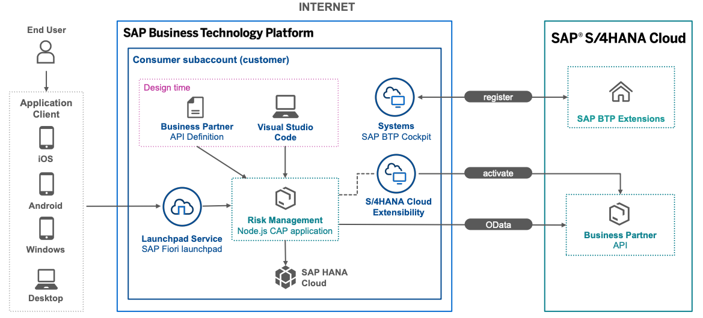

# Consume Remote Services

> Base on project template: [btp-cap-monorepo](../../btp-cap-monorepo/)

how to get an API definition from the SAP API Business Hub, and how to import an API definition to your project.



CAP supports the service consumption with dedicated APIs to import service definitions, query remote services, mash up services, and work locally as long as possible.

> When changed the db defination, you need use command `cds deploy` to redeploy it to database.

## SAP API Business Hub

SAP publishes service definitions for its major products on [SAP API Business Hub](https://api.sap.com/).

Try to find the service [**Business Partner (A2X)**](https://api.sap.com/api/API_BUSINESS_PARTNER/overview) and download the edmx file.

In folder [caps/app-store](../../btp-cap-monorepo/caps/app-store/) execute the command import api defination:

`cds import ~/Downloads/API_BUSINESS_PARTNER.edmx`

Use the external service in your service definition.

## Connect to the sandbox service

`npm install @sap-cloud-sdk/http-client @sap-cloud-sdk/util`

Add credentials for the external service in profile sandbox:

```json
"API_BUSINESS_PARTNER": {
    "kind": "odata-v2",
    "model": "srv/external/API_BUSINESS_PARTNER",
    "[sandbox]": {
        "credentials": {
        "url": "https://sandbox.api.sap.com/s4hanacloud/sap/opu/odata/sap/API_BUSINESS_PARTNER/"
        }
    }
}
```

Run server with profile sandbox: `cds watch --profile sandbox`

### Add the API key

You take an API key from SAP API Business Hub, add it to the credentials in the profile sandbox in file `.cdsrc-private.json`:

```json
{
  "requires": {
    "API_BUSINESS_PARTNER": {
        "[sandbox]": {
            "credentials": {
                "headers": {
                    "APIKey": "your api key"
                }
            }
        }
    }
  }
}
```

### Delegate to the external service

Delegate the odata request to the external service using custom handler:

```typescript
import cds from '@sap/cds'

/**
 * Service implementation for the cds service defined in /srv/risk-service.cds
 *
 */
export default cds.service.impl(async function () {
  const bupa = await cds.connect.to('API_BUSINESS_PARTNER')

  /**
   * delegate request to the remote service
   */
  this.on('READ', 'Suppliers', async (req) => {
    return bupa.run(req.query)
  })

  this.after('READ', 'Risks', (risksData) => {})
})
```

## Add Supplier to Risks entity

Add the association supplier to the entity Risks in file `db/risk-management.cds`:

```javascript
entity Risks : managed {
  ...
  supplier    : Association to Suppliers;
}
```

This managed association adds a property `supplier_ID` to the `Risks` entity under the hood, so that the key and the ID field of the supplier can be stored.

Add the following code to your `src/risk-service-handler.ts` file to handle the expands for supplier data of Risks:

```javascript
// Risks?$expand=supplier
this.on('READ', 'Risks', async (req, next) => {
  if (!req.query.SELECT.columns) return next()
  const expandIndex = req.query.SELECT.columns.findIndex(({ expand, ref }) => expand && ref[0] === 'supplier')
  if (expandIndex < 0) return next()

  // Remove expand from query
  req.query.SELECT.columns.splice(expandIndex, 1)

  // Make sure supplier_ID will be returned
  if (
    !(req.query.SELECT.columns.indexOf('*') >= 0) &&
    !req.query.SELECT.columns.find((column) => column.ref && column.ref.find((ref) => ref == 'supplier_ID'))
  ) {
    req.query.SELECT.columns.push({ ref: ['supplier_ID'] })
  }

  const risks = await next()

  const asArray = (x) => (Array.isArray(x) ? x : [x])

  // Request all associated suppliers
  const supplierIds = asArray(risks).map((risk) => risk.supplier_ID)
  const suppliers = await bupa.run(SELECT.from('RiskService.Suppliers').where({ ID: supplierIds }))

  // Convert in a map for easier lookup
  const suppliersMap = {}
  for (const supplier of suppliers) suppliersMap[supplier.ID] = supplier

  // Add suppliers to result
  for (const note of asArray(risks)) {
    note.supplier = suppliersMap[note.supplier_ID]
  }

  return risks
})
```

The code first makes sure an expand for a supplier is requested. Then, the expand is removed from the query because it can’t be handled by the CAP server generically.

To identify the suppliers that are needed, the risks are read by calling next(). This way, all following handlers are called, including the built-in CAP handler that reads the risks from the database and returns them. The code makes sure that the required supplier_ID field is returned.

All the required suppliers are read with one request from API_BUSINESS_PARTNER service and added to the respective risks.

