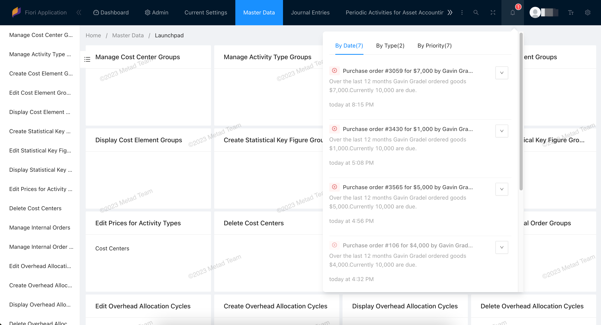

# 📨 Notifications

**English** | [**中文**](../zh/s4h/Notification.md)

> Notifications are the best way to make users aware of a situation that requires timely action or attention. This could be a situation that has just arisen or a task triggered by a workflow.

You can enable Fiori notification refer to this blog [Fiori Launchpad – Notification Configuration](https://blogs.sap.com/2023/08/03/fiori-launchpad-notification-icon-configuration/)

## Notification Messages

Users access notifications by clicking the bell icon in the shell bar at the top right of the screen.

In the notifications popover, the user can order notifications in various ways, take action, and navigate to the source of a specific notification.

### Usage

- Use notifications to make users aware of situations that require attention.
- Reduce the amount of information and the number of actions to a minimum, but provide enough information to help users decide if the information is important.
- Use notification list items and notification list groups only in the SAP Fiori notifications popover.

## Priority

High-priority notifications are shown using the banner. The banner appears on the upper right-hand corner of the screen for a short period of time and then disappears. We recommend setting a notification to high priority if you need to get the user’s immediate attention.

Priority has following value:

- **HIGH**
- **MEDIUM**
- **NEUTRAL**
- **LOW**

## Action

Actions are associated with notifications to allow users to act on notifications from within the notification popover. The number of operations should be as small as possible to avoid confusing the user.

## ABAP Development

How to create and respond to notifications and actions, please refer to the sample programs in the system:
- The program `/IWNGW/R_BEP_DEMO_CREATE_NOTIF` demonstrates how to create notifications.
- The class `/iwngw/cl_demo_notif_provider` demonstrates how to create notification parameters, actions, text, and how to respond to actions performed by the user.

## 🧱 Best practices

### Cache

To make the changes you have made to your notification config in your SAP system, refresh the cache using the transaction _**/IWNGW/H_CLEAR_CACHE**_ .
